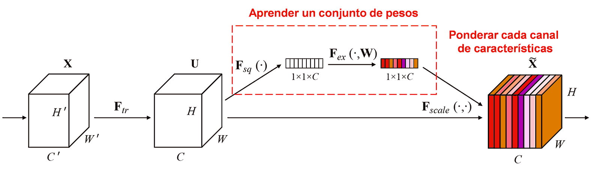
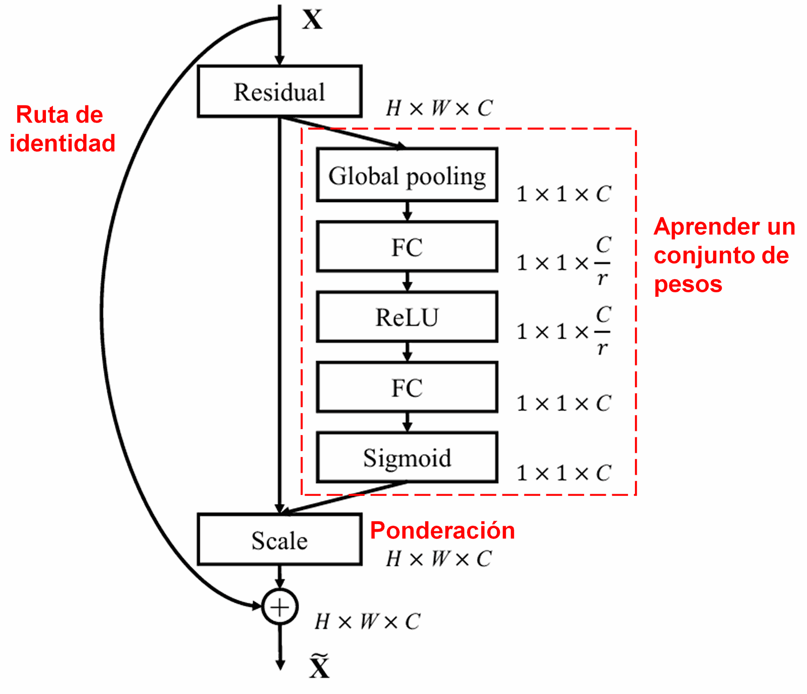
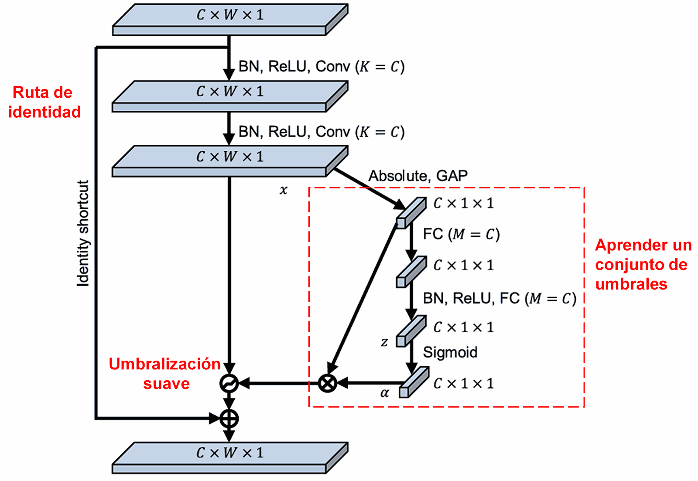
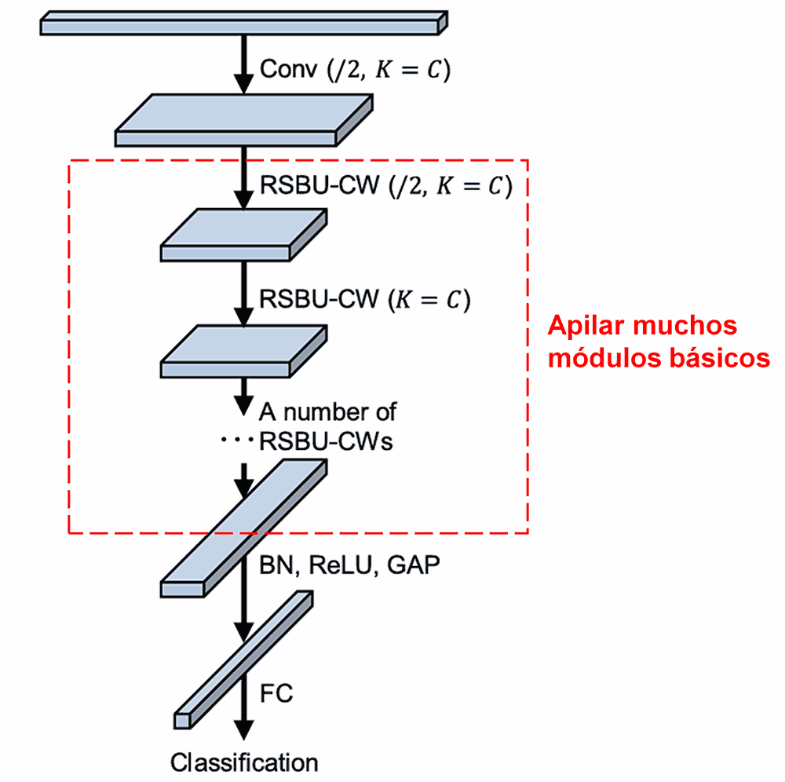

# Red de Contracción Residual Profunda (Deep Residual Shrinkage Network): Un método de inteligencia artificial para datos altamente ruidosos

**La Red de Contracción Residual Profunda es una versión mejorada de la Red Residual Profunda (*Deep Residual Network*). En esencia, es una integración de la Red Residual Profunda, los mecanismos de atención y las funciones de umbralización suave (*soft thresholding*).**

**Hasta cierto punto, el principio de funcionamiento de la Red de Contracción Residual Profunda se puede entender de la siguiente manera: utiliza mecanismos de atención para identificar ("notar") las características poco importantes y emplea funciones de umbralización suave para ponerlas a cero; o, dicho de otra manera, utiliza mecanismos de atención para identificar las características importantes y las conserva, fortaleciendo así la capacidad de la red neuronal profunda para extraer características útiles de señales que contienen ruido.**

## 1. Motivación de la investigación
**En primer lugar, al clasificar muestras, es inevitable que estas contengan cierto tipo de ruido, como ruido gaussiano, ruido rosa, ruido laplaciano, etc.** En un sentido más amplio, es muy probable que las muestras contengan información irrelevante para la tarea de clasificación actual, y esta información también puede entenderse como ruido. Este ruido puede tener un impacto negativo en la eficacia de la clasificación. (La umbralización suave es un paso clave en muchos algoritmos de reducción de ruido de señales).

Por ejemplo, al conversar al lado de una carretera, el audio de la charla puede mezclarse con el sonido de las bocinas de los vehículos, el ruido de las ruedas, etc. Al realizar el reconocimiento de voz sobre estas señales sonoras, el resultado se verá inevitablemente afectado por estos sonidos de fondo. Desde la perspectiva del aprendizaje profundo (*Deep Learning*), las características correspondientes a estas bocinas y ruedas deberían ser eliminadas dentro de la red neuronal profunda para evitar que afecten la eficacia del reconocimiento de voz.

**En segundo lugar, incluso dentro del mismo conjunto de muestras (*dataset*), la cantidad de ruido suele variar de una muestra a otra.** (Esto tiene similitudes con los mecanismos de atención; tomando como ejemplo un conjunto de imágenes, la posición del objeto objetivo puede ser diferente en cada imagen, y el mecanismo de atención puede enfocarse en la posición específica del objeto objetivo en cada imagen).

Por ejemplo, al entrenar un clasificador de perros y gatos, consideremos 5 imágenes etiquetadas como "perro": la 1ª imagen podría contener simultáneamente un perro y un ratón, la 2ª un perro y un ganso, la 3ª un perro y una gallina, la 4ª un perro y un burro, y la 5ª un perro y un pato. Al entrenar el clasificador de perros y gatos, inevitablemente sufriremos la interferencia de objetos irrelevantes como ratones, gansos, gallinas, burros y patos, lo que provocará una disminución en la precisión de la clasificación. Si pudiéramos identificar estos elementos irrelevantes y eliminar las características correspondientes a ellos, sería posible mejorar la precisión del clasificador.

## 2. Umbralización suave (*Soft Thresholding*)
**La umbralización suave es un paso central en muchos algoritmos de reducción de ruido en señales. Elimina las características cuyo valor absoluto es menor que un cierto umbral y contrae hacia cero las características cuyo valor absoluto es mayor que dicho umbral (de ahí el término "Contracción" o *Shrinkage*)**. Se puede implementar mediante la siguiente fórmula:

$$
y = \begin{cases} 
x - \tau & x > \tau \\ 
0 & -\tau \le x \le \tau \\ 
x + \tau & x < -\tau 
\end{cases}
$$

La derivada de la salida de la umbralización suave con respecto a la entrada es:

$$
\frac{\partial y}{\partial x} = \begin{cases} 
1 & x > \tau \\ 
0 & -\tau \le x \le \tau \\ 
1 & x < -\tau 
\end{cases}
$$

Como se puede observar, la derivada de la umbralización suave es 1 o 0. Esta propiedad es idéntica a la de la función de activación ReLU. Por lo tanto, la umbralización suave también puede reducir el riesgo de que los algoritmos de aprendizaje profundo sufran problemas de desvanecimiento del gradiente (*gradient vanishing*) y explosión del gradiente (*gradient exploding*).

**En la función de umbralización suave, la configuración del umbral debe cumplir dos condiciones: Primero, el umbral debe ser un número positivo; Segundo, el umbral no puede ser mayor que el valor máximo de la señal de entrada, de lo contrario, la salida sería totalmente cero.**

**Al mismo tiempo, es preferible que el umbral cumpla una tercera condición: cada muestra debe tener su propio umbral independiente, basado en su propio contenido de ruido.**

Esto se debe a que el contenido de ruido suele ser diferente en muchas muestras. Por ejemplo, ocurre con frecuencia que en un mismo conjunto de muestras, la Muestra A contenga menos ruido y la Muestra B contenga más ruido. En tal caso, si se realiza una umbralización suave en un algoritmo de reducción de ruido, la Muestra A debería adoptar un umbral mayor, y la Muestra B debería adoptar un umbral menor. En las redes neuronales profundas, aunque estas características y umbrales pierden su significado físico explícito, la lógica básica sigue siendo la misma. Es decir, cada muestra debe tener su propio umbral independiente, determinado por su propio contenido de ruido.

## 3. Mecanismo de atención
El mecanismo de atención es relativamente fácil de entender en el campo de la visión por computadora (*Computer Vision*). El sistema visual de los animales puede escanear rápidamente toda un área para descubrir el objeto objetivo y, a continuación, concentrar la atención en dicho objeto para extraer más detalles, suprimiendo al mismo tiempo la información irrelevante. Para detalles concretos, por favor consulte la literatura académica sobre mecanismos de atención.

Squeeze-and-Excitation Network (SENet) es un método de aprendizaje profundo relativamente nuevo basado en mecanismos de atención. En diferentes muestras, la contribución de los distintos canales de características a la tarea de clasificación suele ser diferente. SENet emplea una pequeña sub-red para obtener un conjunto de pesos (*weights*) y, posteriormente, multiplica estos pesos por las características de los canales respectivos para ajustar la magnitud de las características de cada canal. Este proceso puede considerarse como la aplicación de diferentes niveles de atención a cada canal de características.

<p align="center">
  
</p>

En este enfoque, cada muestra tendrá su propio conjunto independiente de pesos. En otras palabras, los pesos de dos muestras cualesquiera son diferentes. En SENet, la ruta específica para obtener los pesos es: "Agrupamiento global (*Global Pooling*) → Capa totalmente conectada (*Fully Connected Layer*) → Función ReLU → Capa totalmente conectada → Función Sigmoide".

<p align="center">
  
</p>

## 4. Umbralización suave bajo un mecanismo de atención profunda
La Red de Contracción Residual Profunda toma como referencia la estructura de la sub-red de SENet mencionada anteriormente para implementar la umbralización suave bajo un mecanismo de atención profunda. A través de la sub-red (indicada dentro del recuadro azul en los diagramas originales), se puede aprender un conjunto de umbrales para aplicar la umbralización suave a cada canal de características.

<p align="center">
  
</p>

En esta sub-red, primero se calcula el valor absoluto de todas las características del mapa de características de entrada. Luego, mediante el agrupamiento promedio global (*Global Average Pooling*) y el promedio, se obtiene una característica, denotada como A. En la otra ruta, el mapa de características resultante del agrupamiento promedio global se introduce en una pequeña red totalmente conectada. Esta red totalmente conectada utiliza la función Sigmoide como su última capa para normalizar la salida entre 0 y 1, obteniendo un coeficiente denotado como α. El umbral final se puede expresar como α × A. Por lo tanto, el umbral es el producto de un número entre 0 y 1 por el promedio de los valores absolutos del mapa de características. **Esta forma no solo garantiza que el umbral sea positivo, sino que también asegura que no sea excesivamente grande.**

**Además, diferentes muestras tendrán diferentes umbrales. Por lo tanto, hasta cierto punto, esto puede entenderse como un mecanismo de atención especial: nota ("presta atención a") las características irrelevantes para la tarea actual, transforma estas características en valores cercanos a 0 a través de dos capas convolucionales, y las pone a cero mediante la umbralización suave; o, dicho de otro modo, nota las características relevantes para la tarea actual, las transforma en valores alejados de 0 a través de dos capas convolucionales y las conserva.**

Finalmente, al apilar una cierta cantidad de módulos básicos junto con capas convolucionales, normalización por lotes (*Batch Normalization*), funciones de activación, agrupamiento promedio global y capas de salida totalmente conectadas, se obtiene la Red de Contracción Residual Profunda completa.

<p align="center">
  
</p>

## 5. Capacidad de generalización (Universalidad)
La Red de Contracción Residual Profunda es, de hecho, un método de aprendizaje de características de propósito general. Esto se debe a que, en muchas tareas de aprendizaje de características, las muestras contienen, en mayor o menor medida, algo de ruido e información irrelevante. Este ruido y la información irrelevante pueden afectar la eficacia del aprendizaje de características. Por ejemplo:

En la clasificación de imágenes, si una imagen contiene simultáneamente muchos otros objetos, estos objetos pueden entenderse como "ruido"; la Red de Contracción Residual Profunda tal vez pueda utilizar el mecanismo de atención para notar este "ruido" y luego emplear la umbralización suave para poner a cero las características correspondientes a este "ruido", lo que podría mejorar la precisión de la clasificación de imágenes.

En el reconocimiento de voz, si el entorno es ruidoso, como al conversar al lado de una carretera o en un taller de fábrica, la Red de Contracción Residual Profunda tal vez pueda mejorar la precisión del reconocimiento de voz, o al menos ofrecer un enfoque capaz de mejorar dicha precisión.

## Referencias

## Impacto Académico

Las citas de este artículo en Google Scholar han superado las 1400.

Según estadísticas conservadoras, la Red de Contracción Residual Profunda ha sido utilizada directamente o mejorada en más de 1000 publicaciones académicas en numerosos campos como la ingeniería mecánica, la energía eléctrica, la visión por computadora, la medicina, el procesamiento de voz, el análisis de texto, el radar y la teledetección.

## Referencias

Minghang Zhao, Shisheng Zhong, Xuyun Fu, Baoping Tang, Michael Pecht, Deep residual shrinkage networks for fault diagnosis, IEEE Transactions on Industrial Informatics, 2020, 16(7): 4681-4690.

[https://ieeexplore.ieee.org/document/8850096](https://ieeexplore.ieee.org/document/8850096)

## BibTeX
```bibtex
@article{Zhao2020,
  author    = {Minghang Zhao and Shisheng Zhong and Xuyun Fu and Baoping Tang and Michael Pecht},
  title     = {Deep Residual Shrinkage Networks for Fault Diagnosis},
  journal   = {IEEE Transactions on Industrial Informatics},
  year      = {2020},
  volume    = {16},
  number    = {7},
  pages     = {4681-4690},
  doi       = {10.1109/TII.2019.2942898}
}
```
