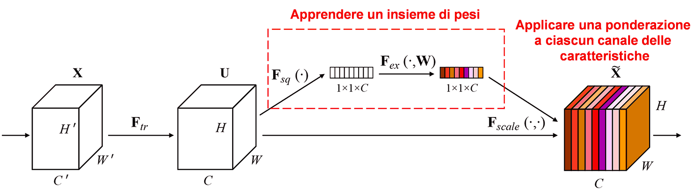
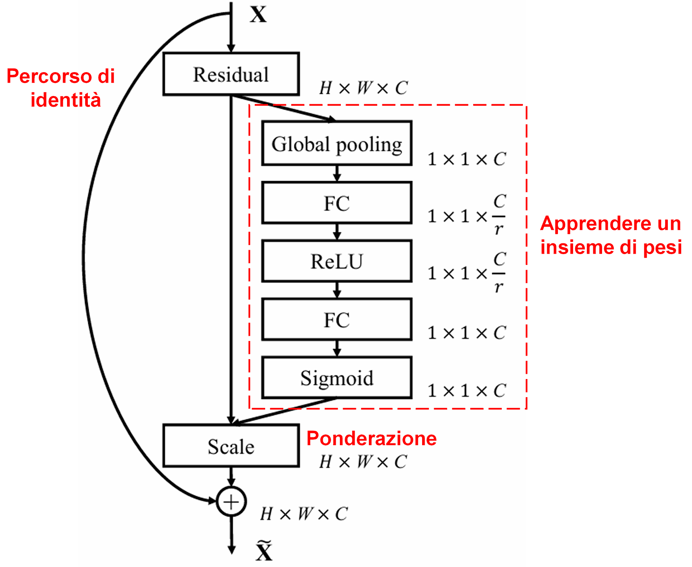
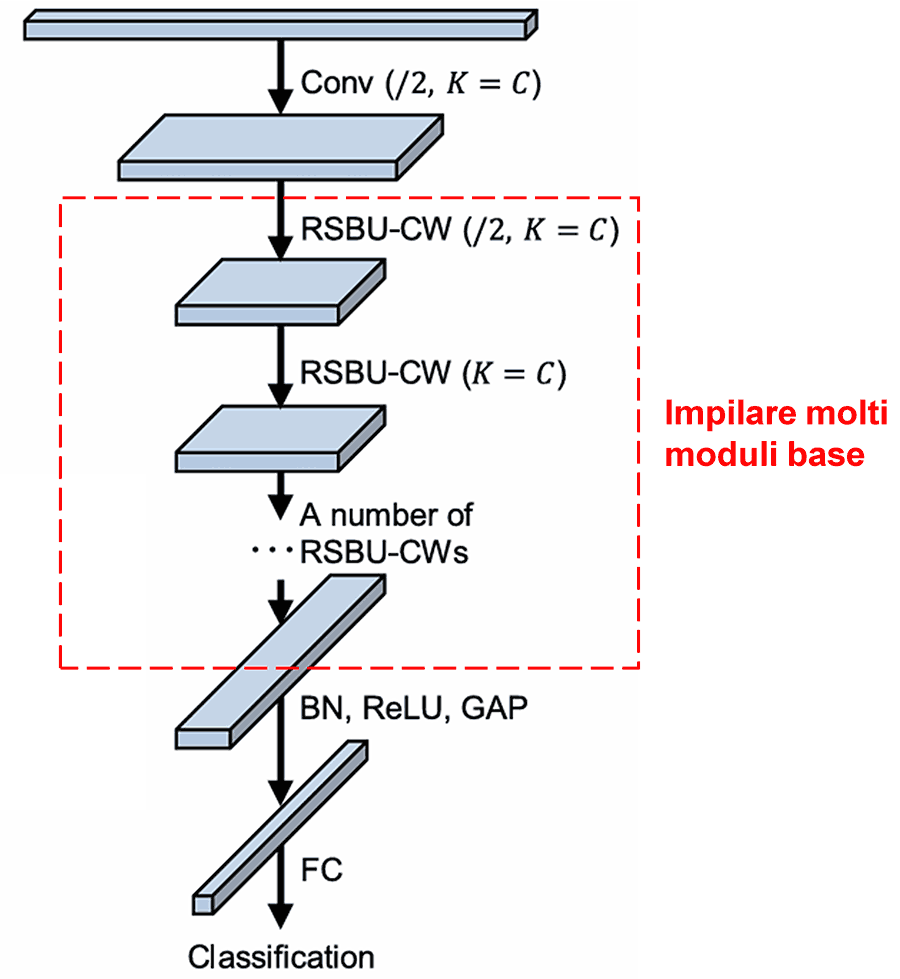

# Rete Residua Profonda a Contrazione (Deep Residual Shrinkage Network): Un metodo di intelligenza artificiale per dati fortemente rumorosi

**La Rete Residua Profonda a Contrazione (Deep Residual Shrinkage Network) è una versione migliorata della Rete Residua Profonda (Deep Residual Network). Essenzialmente, rappresenta un'integrazione tra le Reti Residue Profonde, i meccanismi di attenzione e le funzioni di sogliatura soffice (soft thresholding).**

**In una certa misura, il principio di funzionamento della Rete Residua Profonda a Contrazione può essere compreso in questo modo: attraverso il meccanismo di attenzione, la rete "nota" le caratteristiche (features) non importanti e le imposta a zero tramite la funzione di sogliatura soffice; oppure, detto in altro modo, attraverso il meccanismo di attenzione la rete "nota" le caratteristiche importanti e le preserva, rafforzando così la capacità della rete neurale profonda di estrarre caratteristiche utili da segnali contenenti rumore.**

## 1. Motivazione della Ricerca
**In primo luogo, quando si classificano i campioni, è inevitabile che essi contengano del rumore, come il rumore Gaussiano, il rumore rosa, il rumore Laplaciano, ecc.** In senso più ampio, è molto probabile che i campioni contengano informazioni non pertinenti al compito di classificazione corrente; anche queste informazioni possono essere intese come "rumore". Tale rumore può avere un impatto negativo sull'efficacia della classificazione. (Si noti che la sogliatura soffice è un passaggio chiave in molti algoritmi di riduzione del segnale, noti come algoritmi di *signal denoising*).

Ad esempio, durante una chiacchierata sul ciglio della strada, la voce della conversazione potrebbe mescolarsi con il suono dei clacson dei veicoli, il rumore delle ruote, ecc. Quando si esegue il riconoscimento vocale su questi segnali audio, l'efficacia del riconoscimento sarà inevitabilmente influenzata da questi suoni di sottofondo. Dal punto di vista del Deep Learning, le caratteristiche corrispondenti a questi clacson e rumori di ruote dovrebbero essere eliminate all'interno della rete neurale profonda, per evitare che influenzino il risultato del riconoscimento vocale.

**In secondo luogo, anche all'interno dello stesso set di campioni, la quantità di rumore in ciascun campione è spesso diversa.** (Questo concetto ha punti in comune con il meccanismo di attenzione; prendendo come esempio un set di campioni di immagini, la posizione dell'oggetto target può variare da un'immagine all'altra; il meccanismo di attenzione è in grado di focalizzarsi sulla posizione dell'oggetto target specifica per ogni immagine).

Per esempio, quando si addestra un classificatore per distinguere cani e gatti, considerando 5 immagini con l'etichetta "cane": la prima immagine potrebbe contenere sia un cane che un topo, la seconda un cane e un'oca, la terza un cane e una gallina, la quarta un cane e un asino, la quinta un cane e un'anatra. Durante l'addestramento del classificatore cane/gatto, saremmo inevitabilmente disturbati da oggetti irrilevanti come topi, oche, galline, asini e anatre, causando un calo dell'accuratezza della classificazione. Se fossimo in grado di "notare" questi elementi irrilevanti (topi, oche, ecc.) ed eliminare le caratteristiche a loro corrispondenti, potremmo aumentare l'accuratezza del classificatore.

## 2. Sogliatura Soffice (Soft Thresholding)
**La sogliatura soffice (spesso indicata con il termine inglese *Soft Thresholding*) è il passaggio centrale di molti algoritmi di riduzione del rumore del segnale. Essa elimina le caratteristiche il cui valore assoluto è inferiore a una certa soglia e "contrae" verso lo zero le caratteristiche il cui valore assoluto è superiore a tale soglia.** Questa operazione di contrazione (shrinkage) può essere realizzata attraverso la seguente formula:

$$
y = \begin{cases} 
x - \tau & x > \tau \\ 
0 & -\tau \le x \le \tau \\ 
x + \tau & x < -\tau 
\end{cases}
$$

La derivata dell'uscita della sogliatura soffice rispetto all'ingresso è:

$$
\frac{\partial y}{\partial x} = \begin{cases} 
1 & x > \tau \\ 
0 & -\tau \le x \le \tau \\ 
1 & x < -\tau 
\end{cases}
$$

Da quanto sopra, si deduce che la derivata della sogliatura soffice è o 1 o 0. Questa proprietà è identica a quella della funzione di attivazione ReLU. Di conseguenza, la sogliatura soffice è anche in grado di ridurre il rischio che gli algoritmi di deep learning incontrino problemi di sparizione del gradiente (*gradient vanishing*) o esplosione del gradiente (*gradient exploding*).

**Nella funzione di sogliatura soffice, l'impostazione della soglia deve soddisfare due condizioni: primo, la soglia deve essere un numero positivo; secondo, la soglia non può essere maggiore del valore massimo del segnale in ingresso, altrimenti l'uscita sarebbe interamente costituita da zeri.**

**Allo stesso tempo, è preferibile che la soglia soddisfi una terza condizione: ogni campione dovrebbe avere una propria soglia indipendente, basata sul proprio contenuto di rumore.**

Questo perché il contenuto di rumore varia spesso tra i diversi campioni. Ad esempio, accade frequentemente che nello stesso set di dati, il campione A contenga poco rumore, mentre il campione B ne contenga molto. Pertanto, quando si applica la sogliatura soffice in un algoritmo di denoising, il campione A dovrebbe adottare una soglia più alta, mentre il campione B dovrebbe adottarne una più bassa (o viceversa, a seconda della logica del segnale, ma il punto chiave è la variabilità). Nelle reti neurali profonde, sebbene queste caratteristiche e soglie perdano un significato fisico esplicito, il principio di base rimane lo stesso. In altre parole, ogni campione deve avere la sua soglia specifica in funzione del proprio livello di rumore.

## 3. Meccanismo di Attenzione
Il meccanismo di attenzione (*Attention Mechanism*) è un concetto relativamente facile da comprendere nel campo della visione artificiale (*Computer Vision*). Il sistema visivo degli animali è in grado di scansionare rapidamente un'intera area, individuare l'oggetto target e quindi concentrare l'attenzione su di esso per estrarre maggiori dettagli, sopprimendo al contempo le informazioni irrilevanti. Per dettagli specifici, si rimanda alla letteratura sui meccanismi di attenzione.

La Squeeze-and-Excitation Network (SENet) rappresenta un metodo di deep learning relativamente recente basato sul meccanismo di attenzione. In campioni diversi, il contributo dei vari canali delle caratteristiche (*feature channels*) al compito di classificazione è spesso diverso. La SENet utilizza una piccola sottorete per ottenere un insieme di pesi (weights), e successivamente moltiplica questi pesi per le caratteristiche dei rispettivi canali, al fine di regolare l'ampiezza delle caratteristiche di ogni canale. Questo processo può essere considerato come l'applicazione di diversi livelli di "attenzione" ai vari canali delle caratteristiche.

<p align="center">
  
</p>

In questa modalità, ogni campione avrà il proprio insieme indipendente di pesi. In altre parole, i pesi di due campioni qualsiasi saranno diversi. Nella SENet, il percorso specifico per ottenere i pesi è: "Global Pooling → Strato completamente connesso (Fully Connected Layer) → Funzione ReLU → Strato completamente connesso → Funzione Sigmoide".

<p align="center">
  
</p>

## 4. Sogliatura Soffice basata su Meccanismo di Attenzione Profonda
La Rete Residua Profonda a Contrazione (Deep Residual Shrinkage Network) prende in prestito la struttura della sottorete SENet sopra menzionata per realizzare una sogliatura soffice guidata da un meccanismo di attenzione profonda. Attraverso la sottorete (indicata solitamente in blu nei diagrammi architetturali), è possibile apprendere un insieme di soglie per applicare la sogliatura soffice ai vari canali delle caratteristiche.

<p align="center">
  
</p>

In questa sottorete, si calcola innanzitutto il valore assoluto di tutte le caratteristiche della mappa delle caratteristiche (*feature map*) in ingresso. Successivamente, attraverso il *Global Average Pooling* e la media, si ottiene una caratteristica, che denotiamo come A. In un altro percorso, la mappa delle caratteristiche dopo il *Global Average Pooling* viene inserita in una piccola rete completamente connessa (*Fully Connected network*). Questa rete completamente connessa utilizza una funzione Sigmoide come ultimo strato, normalizzando l'uscita tra 0 e 1 per ottenere un coefficiente, che denotiamo come α. La soglia finale può essere espressa come α × A. Pertanto, la soglia è costituita da un numero tra 0 e 1 moltiplicato per la media del valore assoluto della mappa delle caratteristiche. **Questo metodo non solo garantisce che la soglia sia positiva, ma assicura anche che non sia eccessivamente grande.**

**Inoltre, campioni diversi avranno soglie diverse. Di conseguenza, questo può essere inteso, in una certa misura, come un meccanismo di attenzione speciale: la rete "nota" le caratteristiche irrilevanti per il compito attuale, le trasforma in valori vicini allo 0 attraverso due strati di convoluzione e le imposta definitivamente a zero tramite la sogliatura soffice; oppure, la rete "nota" le caratteristiche rilevanti per il compito, le trasforma in valori lontani dallo 0 tramite i due strati di convoluzione e le preserva.**

Infine, impilando un certo numero di questi moduli base insieme a strati di convoluzione, *Batch Normalization*, funzioni di attivazione, *Global Average Pooling* e strati di uscita completamente connessi, si ottiene la Rete Residua Profonda a Contrazione completa.

<p align="center">
  
</p>

## 5. Generalità e Applicabilità
La Rete Residua Profonda a Contrazione è, di fatto, un metodo di apprendimento delle caratteristiche (*feature learning*) di uso generale. Questo perché in molti compiti di apprendimento delle caratteristiche, i campioni contengono più o meno rumore e informazioni non correlate. Tale rumore e tali informazioni irrilevanti possono influenzare negativamente l'efficacia dell'apprendimento. Per esempio:

Nella classificazione delle immagini, se un'immagine contiene contemporaneamente molti altri oggetti, questi possono essere intesi come "rumore"; la Rete Residua Profonda a Contrazione potrebbe essere in grado, grazie al meccanismo di attenzione, di notare questo "rumore" e, tramite la sogliatura soffice, impostare a zero le caratteristiche corrispondenti, aumentando così potenzialmente l'accuratezza della classificazione delle immagini.

Nel riconoscimento vocale, in ambienti sonori rumorosi, come durante una conversazione sul ciglio di una strada o in un'officina industriale, la Rete Residua Profonda a Contrazione potrebbe migliorare l'accuratezza del riconoscimento, o quantomeno fornire un approccio valido per incrementare tale accuratezza.

## Bibliografia

Minghang Zhao, Shisheng Zhong, Xuyun Fu, Baoping Tang, Michael Pecht, Deep residual shrinkage networks for fault diagnosis, IEEE Transactions on Industrial Informatics, 2020, 16(7): 4681-4690.

[https://ieeexplore.ieee.org/document/8850096](https://ieeexplore.ieee.org/document/8850096)

## BibTeX
```bibtex
@article{Zhao2020,
  author    = {Minghang Zhao and Shisheng Zhong and Xuyun Fu and Baoping Tang and Michael Pecht},
  title     = {Deep Residual Shrinkage Networks for Fault Diagnosis},
  journal   = {IEEE Transactions on Industrial Informatics},
  year      = {2020},
  volume    = {16},
  number    = {7},
  pages     = {4681-4690},
  doi       = {10.1109/TII.2019.2942898}
}
```

## Impatto Accademico

Il numero di citazioni di questo articolo su Google Scholar ha superato quota 1400.

Secondo statistiche incomplete, la Rete Residua Profonda a Contrazione è stata applicata direttamente, o migliorata e applicata, in oltre 1000 pubblicazioni accademiche in numerosi settori, tra cui ingegneria meccanica, ingegneria elettrica, visione artificiale, campo medico, elaborazione vocale, elaborazione del testo, radar e telerilevamento.
