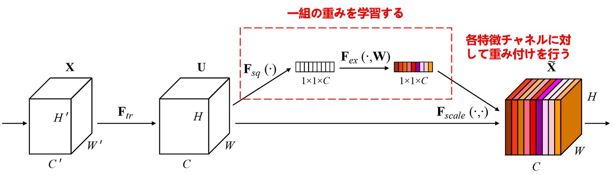
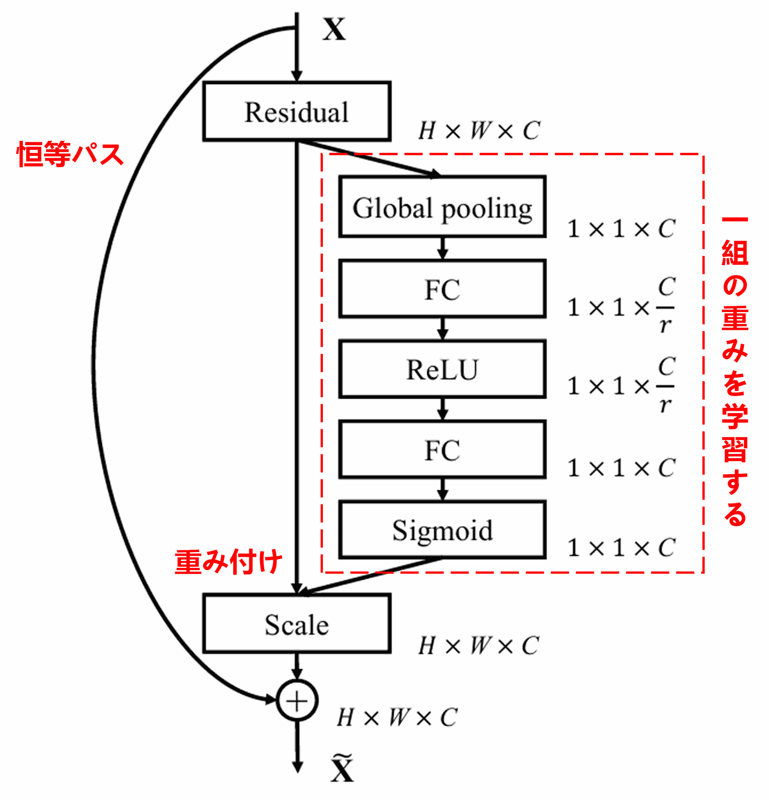
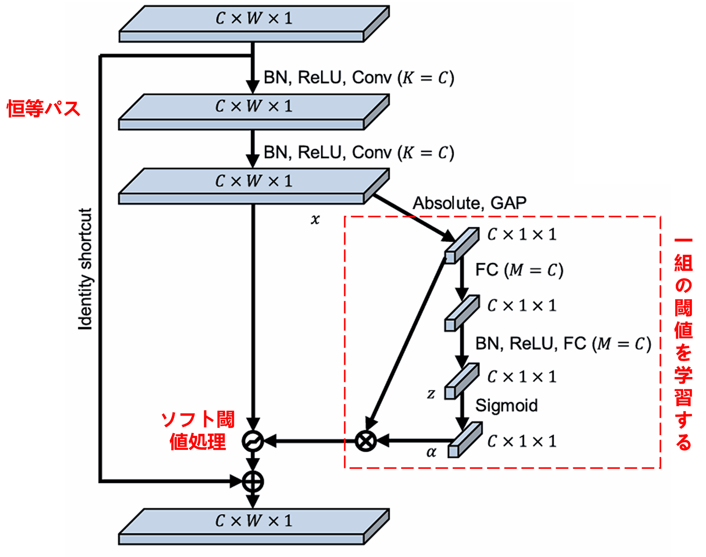
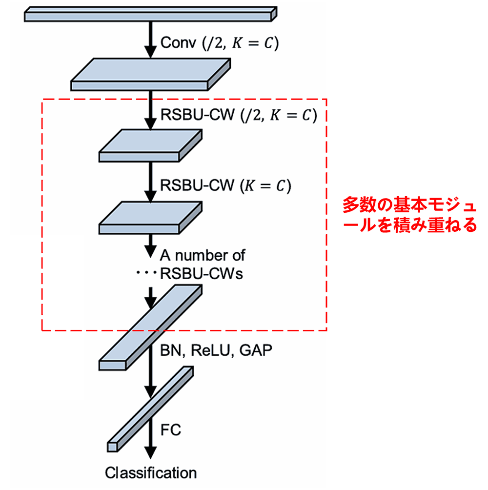

# 深層残差収縮ネットワーク(Deep Residual Shrinkage Network)：強ノイズデータのための人工知能手法

**深層残差収縮ネットワークは、深層残差ネットワーク（ResNet）の改良版の一種であり、実質的には深層残差ネットワーク、アテンションメカニズム（注意機構）、およびソフト閾値処理関数の統合体と言えます。**

**ある程度において、深層残差収縮ネットワークの動作原理は次のように理解できます。すなわち、アテンションメカニズムを通じて重要でない特徴を特定し、ソフト閾値処理関数によってそれらをゼロにする、あるいは、アテンションメカニズムを通じて重要な特徴に着目してそれらを保持することで、ノイズを含む信号から有用な特徴を抽出する深層ニューラルネットワークの能力を強化する、ということです。**

## 1.研究動機
**まず、サンプルを分類する際、サンプルにはガウスノイズ、ピンクノイズ、ラプラスノイズなどのノイズが不可避に含まれます**。より広義には、サンプルには現在の分類タスクに関係のない情報が含まれている可能性が高く、これらの情報もノイズとして理解できます。これらのノイズは分類性能に悪影響を及ぼす可能性があります。（ソフト閾値処理は、多くの信号ノイズ除去アルゴリズムにおける重要なステップの一つです。）

例を挙げると、道路脇で会話をしている場合、会話の音声には車のクラクションや走行音などが混入する可能性があります。これらの音声信号に対して音声認識を行う際、認識精度は不可避的にクラクションや走行音の影響を受けます。深層学習の観点からは、音声認識への悪影響を避けるため、これらのクラクションや走行音に対応する特徴は、深層ニューラルネットワーク内部で削除されるべきです。

**次に、同じサンプルセットであっても、個々のサンプルのノイズ量は往々にして異なります**。（これはアテンションメカニズムと共通する点があります。画像サンプルセットを例にとると、各画像における対象物体の位置は異なる可能性がありますが、アテンションメカニズムは各画像に対して対象物体の位置に着目することができます。）

例えば、犬猫分類器を訓練する際、「犬」というラベルの付いた5枚の画像があるとします。1枚目には犬とネズミ、2枚目には犬とガチョウ、3枚目には犬と鶏、4枚目には犬とロバ、5枚目には犬とアヒルが同時に写っているかもしれません。犬猫分類器の訓練時には、ネズミ、ガチョウ、鶏、ロバ、アヒルといった無関係な物体の干渉を避けられず、分類精度の低下を招きます。もし、これらの無関係なネズミ、ガチョウ、鶏、ロバ、アヒルに注目し、それらに対応する特徴を削除することができれば、犬猫分類器の精度を向上させられる可能性があります。

## 2.ソフト閾値処理
**ソフト閾値処理（Soft Thresholding）は、多くの信号ノイズ除去アルゴリズムにおける核心的なステップであり、絶対値がある閾値（しきい値）より小さい特徴を削除し、絶対値がその閾値より大きい特徴をゼロの方向へ収縮させる処理です**。これは以下の式で実現できます：

$$
y = \begin{cases} 
x - \tau & x > \tau \\ 
0 & -\tau \le x \le \tau \\ 
x + \tau & x < -\tau 
\end{cases}
$$

ソフト閾値処理の出力の入力に対する導関数は以下の通りです：

$$
\frac{\partial y}{\partial x} = \begin{cases} 
1 & x > \tau \\ 
0 & -\tau \le x \le \tau \\ 
1 & x < -\tau 
\end{cases}
$$

上記から分かるように、ソフト閾値処理の導関数は1か0のいずれかです。この性質はReLU活性化関数と同じです。したがって、ソフト閾値処理もまた、深層学習アルゴリズムが勾配消失や勾配爆発のリスクに遭遇するのを軽減することができます。

**ソフト閾値処理関数において、閾値の設定は2つの条件を満たす必要があります。第一に、閾値は正の数であること。第二に、閾値は入力信号の最大値を超えてはならないこと（そうでなければ出力がすべてゼロになってしまいます）**。

**同時に、閾値は第三の条件も満たすことが望ましいと言えます。それは、各サンプルが自身のノイズ含有量に応じて、独自の独立した閾値を持つべきであるということです**。

なぜなら、多くのサンプルにおいてノイズ含有量は頻繁に異なるからです。例えば、同じサンプルセット内でも、サンプルAはノイズが少なく、サンプルBはノイズが多いという状況がよくあります。その場合、ノイズ除去アルゴリズム内でソフト閾値処理を行う際、サンプルAにはより大きな閾値を、サンプルBにはより小さな閾値を採用すべきとなります。深層ニューラルネットワークにおいては、これらの特徴や閾値は明確な物理的意味を失いますが、基本的な理屈は通底しています。つまり、各サンプルは自身のノイズ含有量に応じて、独自の独立した閾値を持つべきなのです。

## 3.アテンションメカニズム
アテンションメカニズム（注意機構）は、コンピュータビジョンの分野では比較的理解しやすい概念です。動物の視覚システムは、全領域を素早くスキャンして対象物体を発見し、そこへ注意を集中させることで、無関係な情報を抑制しながら詳細な情報を抽出します。詳細はアテンションメカニズムに関する文献を参照してください。

Squeeze-and-Excitation Network（SENet）は、アテンションメカニズムに基づく比較的新しい深層学習手法です。異なるサンプルにおいて、異なる特徴チャネルが分類タスクに与える貢献度は往々にして異なります。SENetは小型のサブネットワークを用いて一組の重みを取得し、その重みを各チャネルの特徴にそれぞれ乗算することで、各チャネルの特徴の大きさを調整します。このプロセスは、各特徴チャネルに対して異なる大きさの注意（アテンション）を付与していると見なすことができます。

<p align="center">
  
</p>

この方式では、各サンプルが、独自の独立した重みを持つことになります。言い換えれば、任意の2つのサンプル間で、その重みは異なります。SENetにおいて、重みを取得する具体的な経路は、「グローバルプーリング → 全結合層 → ReLU関数 → 全結合層 → Sigmoid関数」となります。

<p align="center">
  
</p>

## 4.深層アテンションメカニズム下のソフト閾値処理
深層残差収縮ネットワークは、前述のSENetのサブネットワーク構造を参考にして、深層アテンションメカニズム下でのソフト閾値処理を実現しています。青い枠内のサブネットワークを通じて一組の閾値を学習し、各特徴チャネルに対してソフト閾値処理を行います。

<p align="center">
  
</p>

このサブネットワークでは、まず入力特徴マップの全特徴に対して絶対値を求めます。次に、グローバル平均プーリング（Global Mean Pooling）と平均化を経て、ある特徴を取得し、これをAとします。もう一方の経路では、グローバル平均プーリング後の特徴マップが小型の全結合ネットワークに入力されます。この全結合ネットワークは最終層にSigmoid関数を持ち、出力を0から1の間に正規化して、ある係数を取得します。これをα（アルファ）とします。最終的な閾値は α×A と表すことができます。したがって、閾値は「0から1の間の数値 × 特徴マップの絶対値の平均」となります。**この方式により、閾値が正であること、そして大きくなりすぎないことが保証されます**。

**さらに、異なるサンプルは異なる閾値を持つことになります。したがって、ある意味で特殊なアテンションメカニズムとして理解できます。すなわち、現在のタスクに無関係な特徴に注目し、2つの畳み込み層を通じてそれらを0に近い特徴に変換し、ソフト閾値処理によってゼロにする。あるいは、現在のタスクに関連する特徴に注目し、2つの畳み込み層を通じてそれらを0から遠い特徴に変換し、それらを保持する、ということです**。

最後に、基本モジュールおよび畳み込み層、バッチ正規化（Batch Normalization）、活性化関数、グローバル平均プーリング、全結合出力層などを一定数積み重ねることで、完全な深層残差収縮ネットワークが構築されます。

<p align="center">
  
</p>

## 5.アルゴリズムの汎用性
深層残差収縮ネットワークは、事実上、汎用的な特徴学習手法です。なぜなら、多くの特徴学習タスクにおいて、サンプルには多かれ少なかれノイズや不適切な情報が含まれているからです。これらのノイズや不適切な情報は、特徴学習の効果に影響を与える可能性があります。例えば：

画像分類において、画像に他の多くの物体が同時に写り込んでいる場合、これらの物体は「ノイズ」として理解できます。深層残差収縮ネットワークは、アテンションメカニズムによってこれらの「ノイズ」に注目し、ソフト閾値処理によってそれらに対応する特徴をゼロにすることで、画像分類の精度を向上させる可能性があります。

音声認識において、例えば道路脇や工場の作業場での会話など、周囲が比較的騒がしい環境下では、深層残差収縮ネットワークによって音声認識の精度が向上する、あるいは音声認識精度を向上させるための一つの考え方が提示される可能性があります。

## 参考文献

Minghang Zhao, Shisheng Zhong, Xuyun Fu, Baoping Tang, Michael Pecht, Deep residual shrinkage networks for fault diagnosis, IEEE Transactions on Industrial Informatics, 2020, 16(7): 4681-4690.

[https://ieeexplore.ieee.org/document/8850096](https://ieeexplore.ieee.org/document/8850096)

## BibTeX
```bibtex
@article{Zhao2020,
  author    = {Minghang Zhao and Shisheng Zhong and Xuyun Fu and Baoping Tang and Michael Pecht},
  title     = {Deep Residual Shrinkage Networks for Fault Diagnosis},
  journal   = {IEEE Transactions on Industrial Informatics},
  year      = {2020},
  volume    = {16},
  number    = {7},
  pages     = {4681-4690},
  doi       = {10.1109/TII.2019.2942898}
}
```

## 学術的インパクト

本論文のGoogle Scholarにおける被引用数は、既に1,400件を超えています。

現在把握している範囲だけでも、深層残差収縮ネットワーク（DRSN）は1,000編以上の文献において、機械、電力、画像、医療、音声、テキスト、レーダー、リモートセンシングなど多岐にわたる分野で、直接的あるいは改良を加えた形で応用されています。
