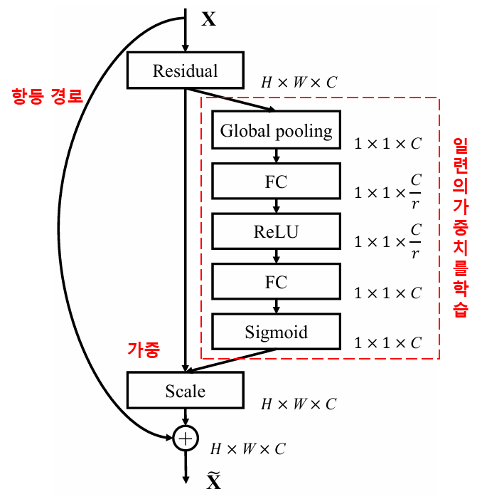
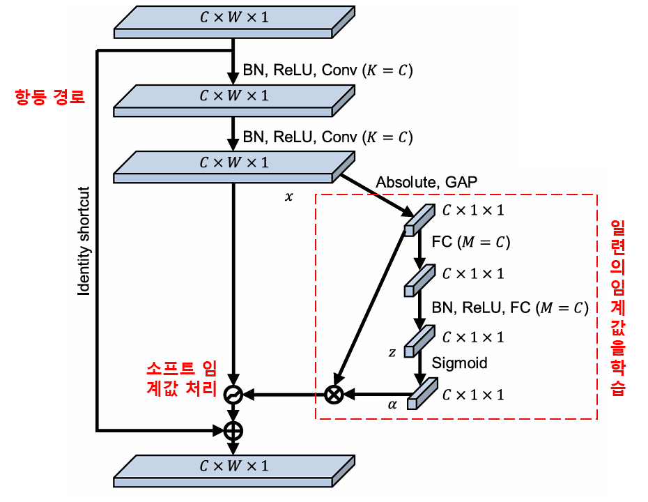
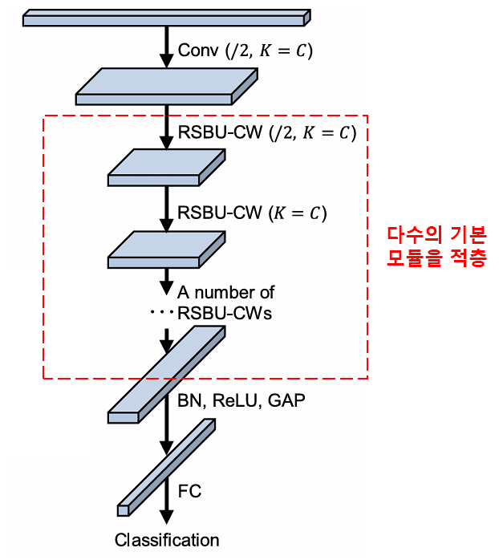

# 심층 잔차 수축 네트워크 (Deep Residual Shrinkage Network): 노이즈가 심한 데이터에 적합한 AI 알고리즘

심층 잔차 수축 네트워크(Deep Residual Shrinkage Network)는 기존의 심층 잔차 네트워크(ResNet)를 개량한 버전으로, 본질적으로는 심층 잔차 네트워크(ResNet), 어텐션 메커니즘(Attention Mechanism), 그리고 소프트 임계값 함수(Soft Thresholding Function)가 통합된 형태라고 할 수 있습니다.

어느 정도 수준에서, 심층 잔차 수축 네트워크의 작동 원리는 다음과 같이 이해할 수 있습니다. 어텐션 메커니즘을 통해 중요하지 않은 특징(Feature)을 포착하여 소프트 임계값 함수를 통해 이를 0으로 만듭니다. 바꾸어 말하면, 어텐션 메커니즘을 통해 중요한 특징을 주목하여 이를 보존함으로써, 심층 신경망이 노이즈가 포함된 신호로부터 유용한 특징을 추출하는 능력을 강화하는 것입니다.

## 1. 연구 동기
첫째, 샘플을 분류할 때 샘플 내에는 가우스 노이즈(Gaussian Noise), 핑크 노이즈(Pink Noise), 라플라스 노이즈(Laplace Noise) 등과 같은 노이즈가 불가피하게 포함됩니다. 더 광의적인 관점에서 보면, 샘플 내에 포함된 현재의 분류 작업과 무관한 정보 또한 노이즈로 간주할 수 있습니다. 이러한 노이즈는 분류 성능에 부정적인 영향을 미칠 수 있습니다. (참고로 소프트 임계값 처리는 다수의 신호 노이즈 제거 알고리즘에서 핵심적인 단계입니다.)

예를 들어, 도로변에서 대화를 나눌 때 대화 소리에는 차량의 경적 소리나 바퀴 소리 등이 섞여 있을 수 있습니다. 이러한 음성 신호에 대해 음성 인식을 수행할 때, 인식 결과는 필연적으로 경적 소리와 바퀴 소리의 영향을 받게 됩니다. 딥러닝(Deep Learning)의 관점에서 볼 때, 이러한 경적 소리와 바퀴 소리에 해당하는 특징들은 심층 신경망 내부에서 제거되어야 음성 인식 성능에 미치는 악영향을 방지할 수 있습니다.

둘째, 동일한 샘플 데이터셋이라 하더라도 각 샘플이 포함하고 있는 노이즈의 양은 서로 다른 경우가 많습니다. (이는 어텐션 메커니즘과 일맥상통하는 부분이 있습니다. 이미지 샘플 데이터셋을 예로 들면, 각 이미지 내에서 목표 물체가 위치한 곳은 서로 다를 수 있습니다. 어텐션 메커니즘은 각 이미지에 맞게 목표 물체가 있는 위치를 주목할 수 있습니다.)

예를 들어, 개와 고양이 분류기(Classifier)를 훈련할 때 '개'라는 라벨이 붙은 5장의 이미지가 있다고 가정해 봅시다. 제1 이미지는 개와 쥐를 동시에 포함하고, 제2 이미지는 개와 거위, 제3 이미지는 개와 닭, 제4 이미지는 개와 당나귀, 제5 이미지는 개와 오리를 동시에 포함할 수 있습니다. 우리가 개와 고양이 분류기를 훈련할 때, 쥐, 거위, 닭, 당나귀, 오리와 같은 무관한 객체들의 간섭을 필연적으로 받게 되며, 이는 분류 정확도의 하락을 초래합니다. 만약 우리가 이러한 무관한 쥐, 거위, 닭, 당나귀, 오리 등을 주목(Attention)하여 그에 해당하는 특징을 제거할 수 있다면, 개와 고양이 분류기의 정확도를 향상시킬 가능성이 있습니다.

## 2. 소프트 임계값 처리 (Soft Thresholding)
소프트 임계값 처리는 많은 신호 노이즈 제거(Denoising) 알고리즘의 핵심 단계로, 절대값이 특정 임계값(Threshold)보다 작은 특징은 제거하고, 절대값이 이 임계값보다 큰 특징은 0(zero) 방향으로 수축(Shrinkage)시키는 것입니다. 이는 다음 수식을 통해 구현할 수 있습니다.
$$
y = \begin{cases} 
x - \tau & x > \tau \\ 
0 & -\tau \le x \le \tau \\ 
x + \tau & x < -\tau 
\end{cases}
$$

입력에 대한 소프트 임계값 처리 결과의 도함수(Derivative)는 다음과 같습니다.
$$
\frac{\partial y}{\partial x} = \begin{cases} 
1 & x > \tau \\ 
0 & -\tau \le x \le \tau \\ 
1 & x < -\tau 
\end{cases}
$$

위에서 알 수 있듯이, 소프트 임계값 처리의 도함수는 1 아니면 0입니다. 이러한 성질은 ReLU 활성화 함수와 동일합니다. 따라서 소프트 임계값 처리 역시 딥러닝 알고리즘이 겪을 수 있는 기울기 소실(Gradient Vanishing) 및 기울기 폭발(Gradient Exploding)의 위험을 줄일 수 있습니다.

소프트 임계값 함수에서 임계값의 설정은 반드시 다음 두 가지 조건을 충족해야 합니다.

첫째, 임계값은 양수여야 합니다.

둘째, 임계값은 입력 신호의 최댓값보다 커서는 안 됩니다. 그렇지 않으면 출력이 모두 0이 됩니다.

동시에, 임계값은 세 번째 조건도 충족하는 것이 바람직합니다. 즉, '각 샘플은 자신의 노이즈 함량에 따라 고유한 독립적인 임계값을 가져야 한다'는 것입니다.

그 이유는 많은 샘플의 노이즈 함량이 종종 서로 다르기 때문입니다. 예를 들어, 동일한 샘플 데이터셋 내에서 샘플 A는 노이즈가 적고, 샘플 B는 노이즈가 많은 상황이 자주 발생합니다. 그렇다면 노이즈 제거 알고리즘에서 소프트 임계값 처리를 수행할 때, 샘플 A는 비교적 작은 임계값을 적용하고, 샘플 B는 비교적 큰 임계값을 적용해야 합니다. 심층 신경망(Deep Neural Network) 내부에서는 이러한 특징과 임계값이 명확한 물리적 의미를 상실하더라도, 기본적인 원리는 동일하게 적용됩니다. 즉, 각 샘플은 자신의 노이즈 함량에 맞춰 자신만의 독립적인 임계값을 가져야 한다는 것입니다.

## 3. 어텐션 메커니즘 (Attention Mechanism)

어텐션 메커니즘은 컴퓨터 비전(Computer Vision) 분야에서 비교적 이해하기 쉬운 개념입니다. 동물의 시각 시스템은 전체 영역을 빠르게 스캔하여 목표 물체를 발견하고, 나아가 주의(Attention)를 목표 물체에 집중시킴으로써 더 많은 세부 정보를 추출하는 동시에 무관한 정보를 억제합니다. 구체적인 내용은 어텐션 메커니즘 관련 문헌을 참조하시기 바랍니다.

SENet(Squeeze-and-Excitation Network)은 비교적 최신의 어텐션 메커니즘 기반 딥러닝 방법론입니다. 서로 다른 샘플에서, 서로 다른 특징 채널(Feature Channel)이 분류 작업에 기여하는 크기는 종종 다릅니다. SENet은 소형 서브 네트워크(Sub-network)를 사용하여 일련의 가중치(Weight)를 획득하고, 이 가중치를 각 채널의 특징과 개별적으로 곱함으로써 각 채널 특징의 크기를 조정합니다. 이 과정은 각 특징 채널에 서로 다른 크기의 주의(Attention)를 부여하는 것으로 간주할 수 있습니다.

<p align="center">
  
</p>

이러한 방식 하에서는 모든 샘플이 자신만의 독립적인 가중치 세트를 갖게 됩니다. 다시 말해, 임의의 두 샘플의 가중치는 서로 다릅니다. SENet에서 가중치를 획득하는 구체적인 경로는 "전역 풀링(Global Pooling) → 완전 연결 층(Fully Connected Layer) → ReLU 함수 → 완전 연결 층 → Sigmoid 함수"입니다.

<p align="center">
  
</p>

## 4. 심층 어텐션 메커니즘 기반의 소프트 임계값 처리

심층 잔차 수축 네트워크는 앞서 언급한 SENet의 서브 네트워크 구조를 차용하여 심층 어텐션 메커니즘 하에서의 소프트 임계값 처리를 구현했습니다. 파란색 박스 내부의 서브 네트워크를 통해 일련의 임계값을 학습하고, 이를 통해 각 특징 채널에 대해 소프트 임계값 처리를 수행할 수 있습니다.

<p align="center">
  
</p>

이 서브 네트워크에서는 먼저 입력 특징 맵(Feature Map)의 모든 특징에 대해 절대값을 구합니다. 그 후 전역 평균 풀링(Global Average Pooling)과 평균화를 거쳐 하나의 특징을 얻는데, 이를 A라고 합시다. 또 다른 경로에서는 전역 평균 풀링 후의 특징 맵이 소형 완전 연결 네트워크(Fully Connected Network)에 입력됩니다. 이 완전 연결 네트워크는 Sigmoid 함수를 마지막 층으로 사용하여 출력을 0과 1 사이로 정규화(Normalization)하며, 여기서 얻은 계수를 $\alpha$라고 합시다. 최종적인 임계값은 $\alpha \times A$로 표현할 수 있습니다. 따라서 임계값은 '0과 1 사이의 숫자 × 특징 맵 절대값의 평균'이 됩니다. 이러한 방식은 임계값이 양수임을 보장할 뿐만 아니라, 값이 지나치게 커지는 것을 방지합니다.

게다가, 서로 다른 샘플은 서로 다른 임계값을 갖게 됩니다. 따라서 어느 정도는 이를 일종의 특수한 어텐션 메커니즘으로 이해할 수 있습니다. 즉, 현재 작업과 무관한 특징을 주목하여 두 개의 합성곱 층(Convolutional Layer)을 통해 이 특징들을 0에 가깝게 변환한 뒤 소프트 임계값 처리를 통해 0으로 만들거나, 혹은 현재 작업과 관련된 특징을 주목하여 두 개의 합성곱 층을 통해 0에서 멀어지게 변환한 뒤 보존하는 것입니다.

마지막으로, 일정 수량의 기본 모듈과 합성곱 층, 배치 정규화(Batch Normalization), 활성화 함수, 전역 평균 풀링 및 완전 연결 출력 층 등을 쌓아 올리면 완전한 심층 잔차 수축 네트워크가 완성됩니다.

<p align="center">
  
</p>

## 5. 범용성 (Generalizability)

심층 잔차 수축 네트워크는 사실상 범용적인 특징 학습(Feature Learning) 방법입니다. 왜냐하면 많은 특징 학습 작업에서 샘플은 다소간의 노이즈나 무관한 정보를 포함하고 있기 때문입니다. 이러한 노이즈와 무관한 정보는 특징 학습의 효과에 영향을 미칠 가능성이 있습니다. 예를 들면 다음과 같습니다.

이미지 분류(Image Classification) 시, 이미지가 다른 많은 물체를 동시에 포함하고 있다면 이러한 물체들은 '노이즈'로 이해될 수 있습니다. 심층 잔차 수축 네트워크는 어텐션 메커니즘을 활용해 이러한 '노이즈'를 주목하고, 소프트 임계값 처리를 통해 이 '노이즈'에 해당하는 특징을 0으로 만듦으로써 이미지 분류의 정확도를 높일 가능성이 있습니다.

음성 인식(Speech Recognition) 시, 도로변이나 공장 작업장과 같이 소음이 심한 환경에서 대화를 나눌 때, 심층 잔차 수축 네트워크는 음성 인식의 정확도를 향상시키거나, 혹은 음성 인식 정확도를 높일 수 있는 하나의 아이디어를 제공할 수 있을 것입니다.

## 참고문헌

Minghang Zhao, Shisheng Zhong, Xuyun Fu, Baoping Tang, Michael Pecht, Deep residual shrinkage networks for fault diagnosis, IEEE Transactions on Industrial Informatics, 2020, 16(7): 4681-4690.

[https://ieeexplore.ieee.org/document/8850096](https://ieeexplore.ieee.org/document/8850096)

## BibTeX
```bibtex
@article{Zhao2020,
  author    = {Minghang Zhao and Shisheng Zhong and Xuyun Fu and Baoping Tang and Michael Pecht},
  title     = {Deep Residual Shrinkage Networks for Fault Diagnosis},
  journal   = {IEEE Transactions on Industrial Informatics},
  year      = {2020},
  volume    = {16},
  number    = {7},
  pages     = {4681-4690},
  doi       = {10.1109/TII.2019.2942898}
}
```
