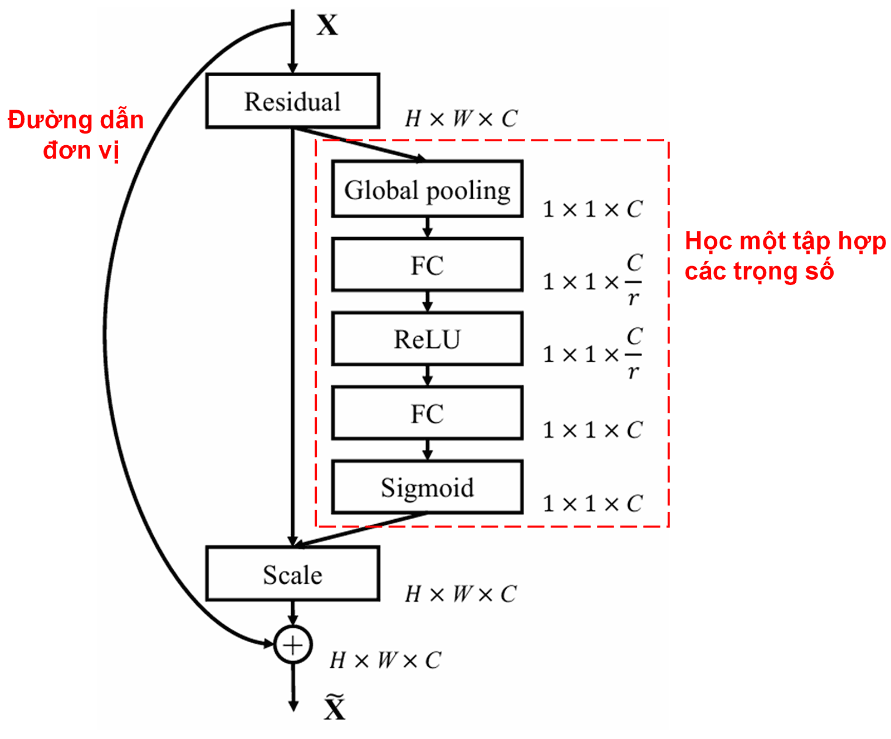
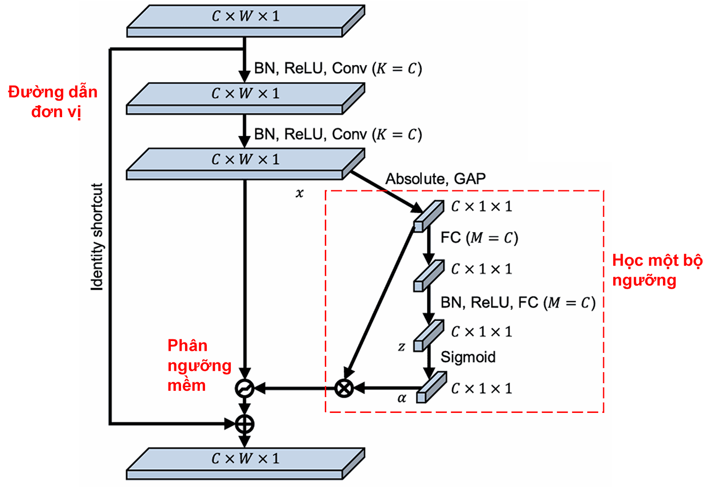
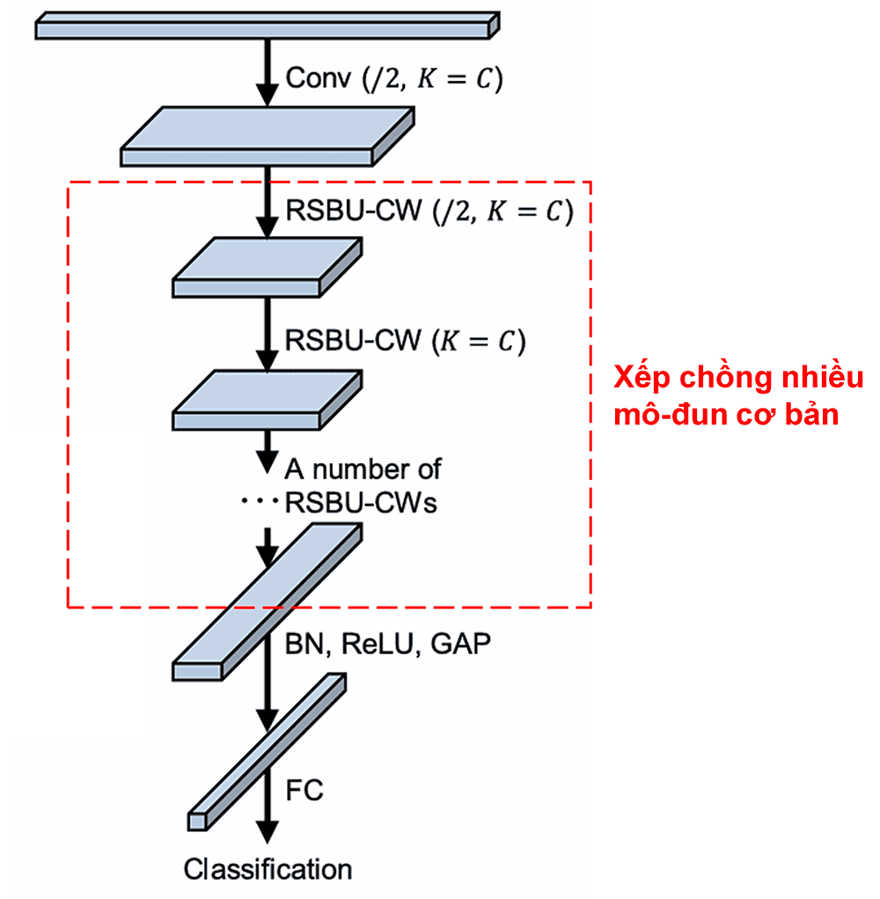

# Mạng Nơ-ron Thặng dư Co rút Sâu (Deep Residual Shrinkage Network): Một phương pháp trí tuệ nhân tạo dành cho dữ liệu nhiễu mạnh

**Mạng Nơ-ron Thặng dư Co rút Sâu (Deep Residual Shrinkage Network) là một phiên bản cải tiến của Mạng Nơ-ron Thặng dư (Deep Residual Network). Về bản chất, đây là sự tích hợp của mạng thặng dư sâu, cơ chế chú ý (attention mechanism) và hàm phân ngưỡng mềm (soft thresholding).**

**Ở một mức độ nhất định, nguyên lý hoạt động của Mạng Nơ-ron Thặng dư Co rút Sâu có thể được hiểu như sau: thông qua cơ chế chú ý, mạng sẽ nhận diện các đặc trưng không quan trọng và sử dụng hàm phân ngưỡng mềm để gán giá trị của chúng về 0; hoặc ngược lại, thông qua cơ chế chú ý để nhận diện các đặc trưng quan trọng và giữ lại chúng. Nhờ đó, khả năng trích xuất các đặc trưng hữu ích từ tín hiệu chứa nhiễu của mạng nơ-ron sâu được tăng cường.**

## 1. Động lực nghiên cứu
**Trước hết, khi thực hiện phân loại mẫu, các mẫu dữ liệu không thể tránh khỏi việc chứa một số loại nhiễu, ví dụ như nhiễu Gaussian, nhiễu hồng (pink noise), nhiễu Laplace, v.v.** Hiểu theo nghĩa rộng hơn, mẫu dữ liệu rất có thể chứa những thông tin không liên quan đến nhiệm vụ phân loại hiện tại, và những thông tin này cũng có thể được coi là nhiễu. Những loại nhiễu này có thể gây ảnh hưởng bất lợi đến hiệu quả phân loại. (Phân ngưỡng mềm là một bước then chốt trong nhiều thuật toán khử nhiễu tín hiệu).

Ví dụ, khi trò chuyện bên lề đường, âm thanh cuộc trò chuyện có thể bị lẫn tạp âm như tiếng còi xe, tiếng bánh xe lăn, v.v. Khi thực hiện nhận dạng giọng nói trên các tín hiệu âm thanh này, hiệu quả nhận dạng chắc chắn sẽ bị ảnh hưởng bởi tiếng còi và tiếng bánh xe. Từ góc độ của học sâu (deep learning), các đặc trưng tương ứng với tiếng còi xe và tiếng bánh xe này cần phải được loại bỏ ngay bên trong mạng nơ-ron sâu để tránh ảnh hưởng đến kết quả nhận dạng giọng nói.

**Thứ hai, ngay cả trong cùng một tập mẫu, lượng nhiễu trong từng mẫu riêng lẻ cũng thường khác nhau.** (Điều này có điểm tương đồng với cơ chế chú ý; lấy ví dụ về một tập mẫu hình ảnh, vị trí của đối tượng mục tiêu trong mỗi bức ảnh có thể khác nhau; cơ chế chú ý có thể nhắm vào vị trí của đối tượng mục tiêu cụ thể cho từng bức ảnh).

Ví dụ, khi huấn luyện bộ phân loại chó-mèo, trong 5 hình ảnh có nhãn là "chó", hình thứ 1 có thể chứa cả chó và chuột, hình thứ 2 chứa chó và ngỗng, hình thứ 3 chứa chó và gà, hình thứ 4 chứa chó và lừa, và hình thứ 5 chứa chó và vịt. Khi chúng ta huấn luyện bộ phân loại chó-mèo, chắc chắn sẽ chịu sự can nhiễu từ các đối tượng không liên quan như chuột, ngỗng, gà, lừa và vịt, dẫn đến giảm độ chính xác phân loại. Nếu chúng ta có thể "chú ý" (nhận biết) được những con vật không liên quan này và loại bỏ các đặc trưng tương ứng với chúng, thì hoàn toàn có khả năng nâng cao độ chính xác của bộ phân loại chó-mèo.

## 2. Phân ngưỡng mềm (Soft Thresholding)
**Phân ngưỡng mềm là bước cốt lõi trong nhiều thuật toán khử nhiễu tín hiệu. Nó loại bỏ các đặc trưng có giá trị tuyệt đối nhỏ hơn một ngưỡng nhất định, và thu hẹp (co rút) các đặc trưng có giá trị tuyệt đối lớn hơn ngưỡng này về hướng 0**. Nó có thể được thực hiện thông qua công thức sau:

$$
y = \begin{cases} 
x - \tau & x > \tau \\ 
0 & -\tau \le x \le \tau \\ 
x + \tau & x < -\tau 
\end{cases}
$$

Đạo hàm của đầu ra hàm phân ngưỡng mềm đối với đầu vào là:

$$
\frac{\partial y}{\partial x} = \begin{cases} 
1 & x > \tau \\ 
0 & -\tau \le x \le \tau \\ 
1 & x < -\tau 
\end{cases}
$$

Từ trên có thể thấy, đạo hàm của phân ngưỡng mềm hoặc là 1, hoặc là 0. Tính chất này giống hệt với hàm kích hoạt ReLU. Do đó, phân ngưỡng mềm cũng có khả năng giảm thiểu rủi ro gặp phải hiện tượng biến mất gradient (gradient vanishing) và bùng nổ gradient (gradient exploding) trong các thuật toán học sâu.

**Trong hàm phân ngưỡng mềm, việc thiết lập ngưỡng phải tuân thủ hai điều kiện: Thứ nhất, ngưỡng phải là số dương; Thứ hai, ngưỡng không được lớn hơn giá trị cực đại của tín hiệu đầu vào, nếu không toàn bộ đầu ra sẽ bằng 0.**

**Đồng thời, ngưỡng tốt nhất nên thỏa mãn điều kiện thứ ba: Mỗi mẫu dữ liệu nên có các ngưỡng độc lập riêng, dựa trên hàm lượng nhiễu của chính nó.**

Lý do là vì hàm lượng nhiễu của nhiều mẫu thường không giống nhau. Ví dụ, thường xuyên xảy ra trường hợp trong cùng một tập dữ liệu, mẫu A chứa ít nhiễu, trong khi mẫu B chứa nhiều nhiễu. Vì vậy, nếu thực hiện phân ngưỡng mềm trong thuật toán khử nhiễu, mẫu A nên áp dụng ngưỡng lớn hơn, và mẫu B nên áp dụng ngưỡng nhỏ hơn. Trong mạng nơ-ron sâu, mặc dù các đặc trưng và ngưỡng này đã mất đi ý nghĩa vật lý rõ ràng, nhưng nguyên lý cơ bản vẫn tương thông. Nói cách khác, mỗi mẫu nên có một ngưỡng độc lập riêng dựa trên hàm lượng nhiễu của chính nó.

## 3. Cơ chế chú ý (Attention Mechanism)
Cơ chế chú ý trong lĩnh vực thị giác máy tính khá dễ hiểu. Hệ thống thị giác của động vật có thể quét nhanh toàn bộ khu vực, phát hiện đối tượng mục tiêu, từ đó tập trung sự chú ý vào đối tượng mục tiêu để trích xuất thêm chi tiết, đồng thời ức chế các thông tin không liên quan. Để biết thêm chi tiết, vui lòng tham khảo các bài viết chuyên về cơ chế chú ý.

Squeeze-and-Excitation Network (SENet) là một phương pháp học sâu khá mới sử dụng cơ chế chú ý. Trong các mẫu khác nhau, mức độ đóng góp của các kênh đặc trưng (feature channels) khác nhau vào nhiệm vụ phân loại thường không giống nhau. SENet sử dụng một mạng con nhỏ (subnet) để thu được một tập hợp các trọng số (weights), sau đó nhân các trọng số này với các đặc trưng của từng kênh tương ứng để điều chỉnh kích thước (độ lớn) của các đặc trưng đó. Quá trình này có thể được coi là đang áp dụng các mức độ chú ý khác nhau lên các kênh đặc trưng.

<p align="center">
  
</p>

Theo cách này, mỗi mẫu dữ liệu sẽ có một tập hợp trọng số độc lập của riêng nó. Nói cách khác, trọng số của hai mẫu bất kỳ đều khác nhau. Trong SENet, đường dẫn cụ thể để thu được trọng số là: "Gộp trung bình toàn cục (Global Pooling) → Lớp toàn kết nối (Fully Connected Layer) → Hàm ReLU → Lớp toàn kết nối → Hàm Sigmoid".

<p align="center">
  
</p>

## 4. Phân ngưỡng mềm dưới cơ chế chú ý sâu
Mạng Nơ-ron Thặng dư Co rút Sâu đã tham khảo cấu trúc mạng con của SENet nêu trên để thực hiện phân ngưỡng mềm dưới cơ chế chú ý sâu. Thông qua mạng con nằm trong khung màu xanh lam, hệ thống có thể học được một tập hợp các ngưỡng để thực hiện phân ngưỡng mềm cho từng kênh đặc trưng.

<p align="center">
  
</p>

Trong mạng con này, đầu tiên tính giá trị tuyệt đối của tất cả các đặc trưng trong bản đồ đặc trưng đầu vào (feature map). Sau đó, trải qua bước gộp trung bình toàn cục và tính trung bình, thu được một đặc trưng, ký hiệu là A. Ở một nhánh khác, bản đồ đặc trưng sau khi gộp trung bình toàn cục được đưa vào một mạng toàn kết nối nhỏ. Mạng toàn kết nối này sử dụng hàm Sigmoid làm lớp cuối cùng để chuẩn hóa đầu ra về khoảng giữa 0 và 1, thu được một hệ số, ký hiệu là α (alpha). Ngưỡng cuối cùng có thể được biểu diễn là α × A. Do đó, ngưỡng chính là: một số trong khoảng 0 và 1 nhân với giá trị trung bình tuyệt đối của bản đồ đặc trưng. **Cách thức này không chỉ đảm bảo ngưỡng là số dương mà còn đảm bảo ngưỡng không quá lớn.**

**Hơn nữa, các mẫu khác nhau sẽ có các ngưỡng khác nhau. Do đó, ở một mức độ nào đó, điều này có thể được hiểu là một cơ chế chú ý đặc biệt: nhận biết các đặc trưng không liên quan đến nhiệm vụ hiện tại, thông qua hai lớp tích chập (convolutional layers) để biến đổi các đặc trưng này thành giá trị tiệm cận 0, rồi dùng hàm phân ngưỡng mềm để gán chúng bằng 0; hoặc ngược lại, nhận biết các đặc trưng liên quan đến nhiệm vụ, biến đổi chúng thành giá trị xa 0 và giữ lại các đặc trưng này.**

Cuối cùng, việc xếp chồng một số lượng nhất định các mô-đun cơ bản cùng với các lớp tích chập, chuẩn hóa theo lô (Batch Normalization), hàm kích hoạt (activation function), gộp trung bình toàn cục và lớp đầu ra toàn kết nối sẽ tạo nên một Mạng Nơ-ron Thặng dư Co rút Sâu hoàn chỉnh.

<p align="center">
  
</p>

## 5. Tính phổ quát
Mạng Nơ-ron Thặng dư Co rút Sâu thực tế là một phương pháp học đặc trưng mang tính phổ quát. Lý do là trong nhiều nhiệm vụ học đặc trưng, các mẫu dữ liệu ít nhiều đều chứa một số nhiễu cũng như thông tin không liên quan. Những nhiễu và thông tin không liên quan này có khả năng ảnh hưởng đến hiệu quả học đặc trưng. Ví dụ:

Trong phân loại hình ảnh, nếu hình ảnh chứa đồng thời nhiều vật thể khác, thì những vật thể này có thể được hiểu là "nhiễu"; Mạng Nơ-ron Thặng dư Co rút Sâu có thể nhờ vào cơ chế chú ý để nhận biết những "nhiễu" này, sau đó nhờ vào phân ngưỡng mềm để gán các đặc trưng tương ứng với "nhiễu" này về 0, từ đó có khả năng nâng cao độ chính xác của việc phân loại hình ảnh.

Trong nhận dạng giọng nói, nếu ở trong môi trường có âm thanh khá ồn ào, ví dụ như khi trò chuyện bên lề đường hay trong xưởng nhà máy, Mạng Nơ-ron Thặng dư Co rút Sâu có thể nâng cao độ chính xác nhận dạng giọng nói, hoặc cung cấp một hướng tư duy giúp nâng cao độ chính xác nhận dạng giọng nói.

## Tài liệu tham khảo

Minghang Zhao, Shisheng Zhong, Xuyun Fu, Baoping Tang, Michael Pecht, Deep residual shrinkage networks for fault diagnosis, IEEE Transactions on Industrial Informatics, 2020, 16(7): 4681-4690.

[https://ieeexplore.ieee.org/document/8850096](https://ieeexplore.ieee.org/document/8850096)

## BibTeX
```bibtex
@article{Zhao2020,
  author    = {Minghang Zhao and Shisheng Zhong and Xuyun Fu and Baoping Tang and Michael Pecht},
  title     = {Deep Residual Shrinkage Networks for Fault Diagnosis},
  journal   = {IEEE Transactions on Industrial Informatics},
  year      = {2020},
  volume    = {16},
  number    = {7},
  pages     = {4681-4690},
  doi       = {10.1109/TII.2019.2942898}
}
```
