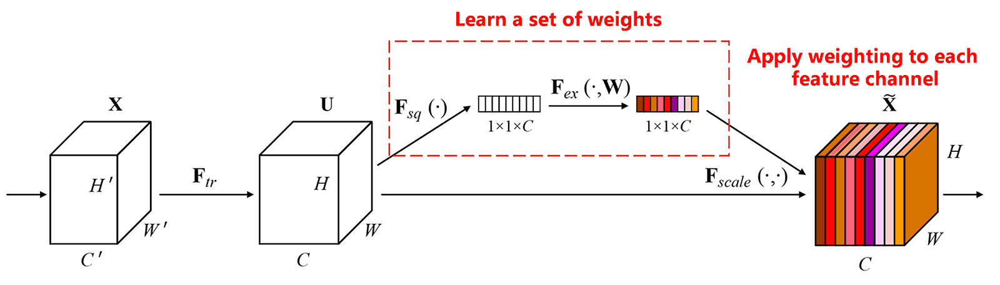
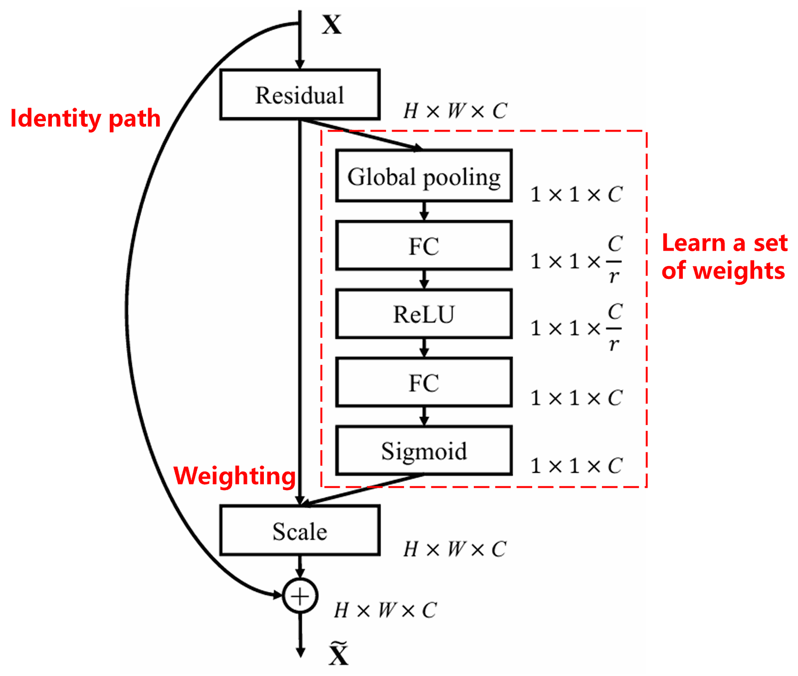

# 深度残差收缩网络：一种适用于强噪声数据的人工智能方法

**深度残差收缩网络是深度残差网络的一种的改进版本，其实是深度残差网络、注意力机制和软阈值函数的集成。**

在一定程度上，**深度残差收缩网络的工作原理**，可以理解为：**通过注意力机制注意到不重要的特征，通过软阈值函数将它们置为零；或者说，通过注意力机制注意到重要的特征，将它们保留下来**，从而加强深度神经网络从含噪声信号中提取有用特征的能力。

## 1.研究动机
**首先，在对样本进行分类的时候，样本中不可避免地会有一些噪声**，就像高斯噪声、粉色噪声、拉普拉斯噪声等。更广义地讲，样本中很可能包含着与当前分类任务无关的信息，这些信息也可以理解为噪声。这些噪声可能会对分类效果产生不利的影响。（软阈值化是许多信号降噪算法中的一个关键步骤）

举例来说，在马路边聊天的时候，聊天的声音里就可能会混杂车辆的鸣笛声、车轮声等等。当对这些声音信号进行语音识别的时候，识别效果不可避免地会受到鸣笛声、车轮声的影响。从深度学习的角度来讲，这些鸣笛声、车轮声所对应的特征，就应该在深度神经网络内部被删除掉，以避免对语音识别的效果造成影响。

**其次，即使是同一个样本集，各个样本的噪声量也往往是不同的。**（这和注意力机制有相通之处；以一个图像样本集为例，各张图片中目标物体所在的位置可能是不同的；注意力机制可以针对每一张图片，注意到目标物体所在的位置）

例如，当训练猫狗分类器的时候，对于标签为“狗”的5张图像，第1张图像可能同时包含着狗和老鼠，第2张图像可能同时包含着狗和鹅，第3张图像可能同时包含着狗和鸡，第4张图像可能同时包含着狗和驴，第5张图像可能同时包含着狗和鸭子。我们在训练猫狗分类器的时候，就不可避免地会受到老鼠、鹅、鸡、驴和鸭子等无关物体的干扰，造成分类准确率下降。如果我们能够注意到这些无关的老鼠、鹅、鸡、驴和鸭子，将它们所对应的特征删除掉，就有可能提高猫狗分类器的准确率。

## 2.软阈值化
**软阈值化，是很多信号降噪算法的核心步骤**，将绝对值小于某个阈值的特征删除掉，将绝对值大于这个阈值的特征朝着零的方向进行收缩。它可以通过以下公式来实现：

$$
y = \begin{cases} 
x - \tau & x > \tau \\ 
0 & -\tau \le x \le \tau \\ 
x + \tau & x < -\tau 
\end{cases}
$$

软阈值化的输出对于输入的导数为：

$$
\frac{\partial y}{\partial x} = \begin{cases} 
1 & x > \tau \\ 
0 & -\tau \le x \le \tau \\ 
1 & x < -\tau 
\end{cases}
$$

由上可知，软阈值化的导数要么是1，要么是0。这个性质是和ReLU激活函数是相同的。因此，软阈值化也能够减小深度学习算法遭遇梯度弥散和梯度爆炸的风险。

**在软阈值化函数中，阈值的设置必须符合两个的条件： 第一，阈值是正数；第二，阈值不能大于输入信号的最大值，否则输出会全部为零。**

**同时，阈值最好还能符合第三个条件：每个样本应该根据自身的噪声含量，有着自己独立的阈值。**

这是因为，很多样本的噪声含量经常是不同的。例如经常会有这种情况，在同一个样本集里面，样本A所含噪声较少，样本B所含噪声较多。那么，如果是在降噪算法里进行软阈值化的时候，样本A就应该采用较大的阈值，样本B就应该采用较小的阈值。在深度神经网络中，虽然这些特征和阈值失去了明确的物理意义，但是基本的道理还是相通的。也就是说，每个样本应该根据自身的噪声含量，有着自己独立的阈值。

## 3.注意力机制
注意力机制在计算机视觉领域是比较容易理解的。动物的视觉系统可以快速扫描全部区域，发现目标物体，进而将注意力集中在目标物体上，以提取更多的细节，同时抑制无关信息。具体请参照注意力机制方面的文章。

Squeeze-and-Excitation Network（SENet）是一种较新的注意力机制下的深度学习方法。 在不同的样本中，不同的特征通道，在分类任务中的贡献大小，往往是不同的。SENet采用一个小型的子网络，获得一组权重，进而将这组权重与各个通道的特征分别相乘，以调整各个通道特征的大小。这个过程，就可以认为是在施加不同大小的注意力在各个特征通道上。

<p align="center">
  
</p>

在这种方式下，每一个样本，都会有自己独立的一组权重。换言之，任意的两个样本，它们的权重，都是不一样的。在SENet中，获得权重的具体路径是，“全局池化→全连接层→ReLU函数→全连接层→Sigmoid函数”。

<p align="center">
  
</p>

## 4.深度注意力机制下的软阈值化
深度残差收缩网络借鉴了上述SENet的子网络结构，以实现深度注意力机制下的软阈值化。通过蓝色框内的子网络，就可以学习得到一组阈值，对各个特征通道进行软阈值化。

<p align="center">
  
</p>

在这个子网络中，首先对输入特征图的所有特征，求它们的绝对值。然后经过全局均值池化和平均，获得一个特征，记为A。在另一条路径中，全局均值池化之后的特征图，被输入到一个小型的全连接网络。这个全连接网络以Sigmoid函数作为最后一层，将输出归一化到0和1之间，获得一个系数，记为α。最终的阈值可以表示为α×A。因此，阈值就是，一个0和1之间的数字×特征图的绝对值的平均。**这种方式，不仅保证了阈值为正，而且不会太大。**

**而且，不同的样本就有了不同的阈值。因此，在一定程度上，可以理解成一种特殊的注意力机制：注意到与当前任务无关的特征，通过两个卷积层将这些特征变换成接近0的特征，通过软阈值化将这些特征置为零；或者说，注意到与当前任务有关的特征，通过两个卷积层将这些特征变换成远离0的特征，将这些特征保留下来。**

最后，堆叠一定数量的基本模块以及卷积层、批标准化、激活函数、全局均值池化以及全连接输出层等，就得到了完整的深度残差收缩网络。

<p align="center">
  
</p>

## 5.算法的通用性
深度残差收缩网络事实上是一种通用的特征学习方法。这是因为很多特征学习的任务中，样本中或多或少都会包含一些噪声，以及不相关的信息。这些噪声和不相关的信息，有可能会对特征学习的效果造成影响。例如说：

在图片分类的时候，如果图片同时包含着很多其他的物体，那么这些物体就可以被理解成“噪声”；深度残差收缩网络或许能够借助注意力机制，注意到这些“噪声”，然后借助软阈值化，将这些“噪声”所对应的特征置为零，就有可能提高图像分类的准确率。

在语音识别的时候，如果在声音较为嘈杂的环境里，比如在马路边、工厂车间里聊天的时候，深度残差收缩网络也许可以提高语音识别的准确率，或者给出了一种能够提高语音识别准确率的思路。

## 参考文献

Minghang Zhao, Shisheng Zhong, Xuyun Fu, Baoping Tang, Michael Pecht, Deep residual shrinkage networks for fault diagnosis, IEEE Transactions on Industrial Informatics, 2020, 16(7): 4681-4690.

[https://ieeexplore.ieee.org/document/8850096](https://ieeexplore.ieee.org/document/8850096)

## BibTeX
```bibtex
@article{Zhao2020,
  author    = {Minghang Zhao and Shisheng Zhong and Xuyun Fu and Baoping Tang and Michael Pecht},
  title     = {Deep Residual Shrinkage Networks for Fault Diagnosis},
  journal   = {IEEE Transactions on Industrial Informatics},
  year      = {2020},
  volume    = {16},
  number    = {7},
  pages     = {4681-4690},
  doi       = {10.1109/TII.2019.2942898}
}
```
